# Bot Action State Transition Graph
# Extracted from server_srv.so
# 150 unique transitions
# Detection: 'call' = direct constructor call, 'vtable' = inlined constructor (vtable install)

## CINSBotActionAmbush
  Update() → **CINSBotCaptureCP** (size=136)
  Update() → **CINSBotCombat** (size=136)
  Update() → **CINSBotInvestigate**

## CINSBotActionCheckpoint
  Update() → **CINSBotCaptureCP** (size=136)
  Update() → **CINSBotCombat** (size=136)
  Update() → **CINSBotEscort** (size=156)
  Update() → **CINSBotGuardCP**
  Update() → **CINSBotGuardDefensive**
  Update() → **CINSBotInvestigate**

## CINSBotActionConquer
  Update() → **CINSBotApproach** (size=100)
  Update() → **CINSBotCombat** (size=136)
  Update() → **CINSBotEscort** (size=156)
  Update() → **CINSBotInvestigate**
  Update() → **CINSBotPatrol**

## CINSBotActionFirefight
  Update() → **CINSBotCaptureCP** (size=136)
  Update() → **CINSBotCombat** (size=136)
  Update() → **CINSBotEscort** (size=156)
  Update() → **CINSBotInvestigate**

## CINSBotActionFlashpoint
  Update() → **CINSBotCaptureCP** (size=136)
  Update() → **CINSBotCombat** (size=136)
  Update() → **CINSBotDestroyCache**
  Update() → **CINSBotInvestigate**

## CINSBotActionHunt
  Update() → **CINSBotApproach** (size=100)
  Update() → **CINSBotCombat** (size=136)
  Update() → **CINSBotEscort** (size=156)
  Update() → **CINSBotInvestigate**
  Update() → **CINSBotPatrol**

## CINSBotActionInfiltrate
  Update() → **CINSBotCaptureFlag**
  Update() → **CINSBotCombat** (size=136)
  Update() → **CINSBotInvestigate**

## CINSBotActionOccupy
  Update() → **CINSBotCaptureCP** (size=136)
  Update() → **CINSBotCombat** (size=136)
  Update() → **CINSBotEscort** (size=156)
  Update() → **CINSBotInvestigate**

## CINSBotActionOutpost
  Update() → **CINSBotCaptureCP** (size=136)
  Update() → **CINSBotCombat** (size=136)
  Update() → **CINSBotDestroyCache**
  Update() → **CINSBotEscort** (size=156)
  Update() → **CINSBotInvestigate**

## CINSBotActionPush
  Update() → **CINSBotCaptureCP** (size=136)
  Update() → **CINSBotCombat** (size=136)
  Update() → **CINSBotEscort** (size=156)
  Update() → **CINSBotInvestigate**

## CINSBotActionSkirmish
  Update() → **CINSBotCaptureCP** (size=136)
  Update() → **CINSBotCombat** (size=136)
  Update() → **CINSBotDestroyCache**
  Update() → **CINSBotEscort** (size=156)
  Update() → **CINSBotInvestigate**

## CINSBotActionStrike
  Update() → **CINSBotCombat** (size=136)
  Update() → **CINSBotDestroyCache**
  Update() → **CINSBotGuardCP**
  Update() → **CINSBotInvestigate**

## CINSBotActionSurvival
  Update() → **CINSBotCaptureCP** (size=136)
  Update() → **CINSBotCombat** (size=136)
  Update() → **CINSBotEscort** (size=156)
  Update() → **CINSBotInvestigate**
  Update() → **CINSBotPatrol**

## CINSBotActionTraining
  Update() → **CINSBotCombat** (size=136)

## CINSBotApproach
  OnStuck() → **CINSBotStuck** (size=108) [vtable]

## CINSBotAttack
  InitialContainedAction() → **CINSBotAttackCQC** (size=80)
  InitialContainedAction() → **CINSBotAttackLMG** (size=80)
  InitialContainedAction() → **CINSBotAttackMelee**
  InitialContainedAction() → **CINSBotAttackPistol** (size=80)
  InitialContainedAction() → **CINSBotAttackRifle** (size=80)
  InitialContainedAction() → **CINSBotAttackSniper** (size=80)
  InitialContainedAction() → **CINSBotFireRPG** (size=112)
  InitialContainedAction() → **CINSBotThrowGrenade** (size=108)
  OnStuck() → **CINSBotStuck** (size=108) [vtable]

## CINSBotAttackAdvance
  OnStart() → **CINSBotAttackInPlace** (size=80)
  Update() → **CINSBotAttackInPlace** (size=80)

## CINSBotAttackCQC
  InitialContainedAction() → **CINSBotAttackAdvance** (size=92)
  InitialContainedAction() → **CINSBotAttackInPlace** (size=80)
  InitialContainedAction() → **CINSBotAttackIntoCover** (size=84)

## CINSBotAttackFromCover
  Update() → **CINSBotAttackInPlace** (size=80)
  Update() → **CINSBotReload** (size=92) [vtable]
  Update() → **CINSBotThrowGrenade** (size=108)

## CINSBotAttackInPlace
  Update() → **CINSBotAttackAdvance** (size=92)

## CINSBotAttackIntoCover
  OnMoveToSuccess() → **CINSBotReload** (size=92) [vtable]
  Update() → **CINSBotAttackFromCover** (size=104)
  Update() → **CINSBotReload** (size=92) [vtable]

## CINSBotAttackLMG
  InitialContainedAction() → **CINSBotAttackAdvance** (size=92)
  InitialContainedAction() → **CINSBotAttackInPlace** (size=80)
  InitialContainedAction() → **CINSBotAttackIntoCover** (size=84)

## CINSBotAttackPistol
  InitialContainedAction() → **CINSBotAttackAdvance** (size=92)
  InitialContainedAction() → **CINSBotAttackInPlace** (size=80)
  InitialContainedAction() → **CINSBotAttackIntoCover** (size=84)

## CINSBotAttackRifle
  InitialContainedAction() → **CINSBotAttackAdvance** (size=92)
  InitialContainedAction() → **CINSBotAttackInPlace** (size=80)
  InitialContainedAction() → **CINSBotAttackIntoCover** (size=84)

## CINSBotAttackSniper
  InitialContainedAction() → **CINSBotAttackInPlace** (size=80)
  InitialContainedAction() → **CINSBotAttackIntoCover** (size=84)

## CINSBotCaptureCP
  OnStuck() → **CINSBotStuck** (size=108) [vtable]
  Update() → **CINSBotDestroyCache**
  Update() → **CINSBotInvestigate**

## CINSBotCombat
  OnStuck() → **CINSBotStuck** (size=108) [vtable]
  Update() → **CINSBotAttack** (size=80)
  Update() → **CINSBotPursue** (size=92)
  Update() → **CINSBotReload** (size=92)
  Update() → **CINSBotRetreat**
  Update() → **CINSBotRetreatToCover** (size=100)
  Update() → **CINSBotSuppressTarget** (size=120)

## CINSBotDead
  Update() → **CINSBotMainAction** (size=64) [vtable]

## CINSBotDestroyCache
  Update() → **CINSBotRetreat**
  Update() → **CINSBotSuppressTarget** (size=120)
  Update() → **CINSBotThrowGrenade** (size=108)

## CINSBotEscort
  Update() → **CINSBotCombat** (size=136)

## CINSBotGamemodeMonitor
  InitialContainedAction() → **CINSBotActionAmbush** (size=64)
  InitialContainedAction() → **CINSBotActionCheckpoint** (size=64) [vtable]
  InitialContainedAction() → **CINSBotActionConquer** (size=72) [vtable]
  InitialContainedAction() → **CINSBotActionFirefight** (size=60) [vtable]
  InitialContainedAction() → **CINSBotActionFlashpoint** (size=60)
  InitialContainedAction() → **CINSBotActionHunt** (size=100) [vtable]
  InitialContainedAction() → **CINSBotActionInfiltrate** (size=60) [vtable]
  InitialContainedAction() → **CINSBotActionOccupy** (size=60) [vtable]
  InitialContainedAction() → **CINSBotActionOutpost** (size=92) [vtable]
  InitialContainedAction() → **CINSBotActionPush** (size=60) [vtable]
  InitialContainedAction() → **CINSBotActionSkirmish** (size=60)
  InitialContainedAction() → **CINSBotActionStrike** (size=56)
  InitialContainedAction() → **CINSBotActionSurvival** (size=72) [vtable]
  InitialContainedAction() → **CINSBotActionTraining** (size=60) [vtable]

## CINSBotInvestigate
  OnStuck() → **CINSBotStuck** (size=108) [vtable]

## CINSBotInvestigationMonitor
  InitialContainedAction() → **CINSBotGamemodeMonitor** (size=56) [vtable]

## CINSBotMainAction
  InitialContainedAction() → **CINSBotTacticalMonitor** (size=152) [vtable]
  Update() → **CINSBotDead** (size=64) [vtable]
  Update() → **CINSBotFlashed** (size=72) [vtable]

## CINSBotPatrol
  OnStuck() → **CINSBotStuck** (size=108) [vtable]

## CINSBotRetreat
  OnMoveToFailure() → **CINSBotReload** (size=92) [vtable]
  OnMoveToSuccess() → **CINSBotReload** (size=92) [vtable]
  OnStuck() → **CINSBotReload** (size=92) [vtable]
  Update() → **CINSBotReload** (size=92) [vtable]

## CINSBotRetreatToCover
  OnMoveToFailure() → **CINSBotReload** (size=92) [vtable]
  OnMoveToSuccess() → **CINSBotReload** (size=92) [vtable]
  OnStart() → **CINSBotRetreat**
  Update() → **CINSBotReload** (size=92) [vtable]

## CINSBotRetreatToHidingSpot
  OnMoveToFailure() → **CINSBotReload** (size=92) [vtable]
  OnMoveToSuccess() → **CINSBotReload** (size=92) [vtable]
  OnStuck() → **CINSBotReload** (size=92) [vtable]
  Update() → **CINSBotReload** (size=92) [vtable]

## CINSBotTacticalMonitor
  InitialContainedAction() → **CINSBotInvestigationMonitor** (size=96) [vtable]
  OnInjured() → **CINSBotRetreatToCover** (size=100)
  OnSight() → **CINSBotRetreatToCover** (size=100)
  Update() → **CINSBotFireRPG** (size=112)
  Update() → **CINSBotReload** (size=92) [vtable]
  Update() → **CINSBotThrowGrenade** (size=108)

## CINSNextBot
  CINSNextBot() → **CINSBotBody** (size=376)
  CINSNextBot() → **CINSBotChatter** (size=12)
  CINSNextBot() → **CINSBotLocomotion**
  CINSNextBot() → **CINSBotVision** (size=640)
  CINSNextBotIntention() → **CINSBotMainAction** (size=64) [vtable]
  Reset() → **CINSBotMainAction** (size=64) [vtable]

## Action Object Sizes

  CINSBotActionAmbush: 64 bytes (0x40)
  CINSBotActionCheckpoint: 64 bytes (0x40)
  CINSBotActionConquer: 72 bytes (0x48)
  CINSBotActionFirefight: 60 bytes (0x3c)
  CINSBotActionFlashpoint: 60 bytes (0x3c)
  CINSBotActionHunt: 100 bytes (0x64)
  CINSBotActionInfiltrate: 60 bytes (0x3c)
  CINSBotActionOccupy: 60 bytes (0x3c)
  CINSBotActionOutpost: 92 bytes (0x5c)
  CINSBotActionPush: 60 bytes (0x3c)
  CINSBotActionSkirmish: 60 bytes (0x3c)
  CINSBotActionStrike: 56 bytes (0x38)
  CINSBotActionSurvival: 72 bytes (0x48)
  CINSBotActionTraining: 60 bytes (0x3c)
  CINSBotApproach: 100 bytes (0x64)
  CINSBotAttack: 80 bytes (0x50)
  CINSBotAttackAdvance: 92 bytes (0x5c)
  CINSBotAttackCQC: 80 bytes (0x50)
  CINSBotAttackFromCover: 104 bytes (0x68)
  CINSBotAttackInPlace: 80 bytes (0x50)
  CINSBotAttackIntoCover: 84 bytes (0x54)
  CINSBotAttackLMG: 80 bytes (0x50)
  CINSBotAttackPistol: 80 bytes (0x50)
  CINSBotAttackRifle: 80 bytes (0x50)
  CINSBotAttackSniper: 80 bytes (0x50)
  CINSBotBody: 376 bytes (0x178)
  CINSBotCaptureCP: 136 bytes (0x88)
  CINSBotChatter: 12 bytes (0xc)
  CINSBotCombat: 136 bytes (0x88)
  CINSBotDead: 64 bytes (0x40)
  CINSBotEscort: 156 bytes (0x9c)
  CINSBotFireRPG: 112 bytes (0x70)
  CINSBotFlashed: 72 bytes (0x48)
  CINSBotGamemodeMonitor: 56 bytes (0x38)
  CINSBotInvestigationMonitor: 96 bytes (0x60)
  CINSBotMainAction: 64 bytes (0x40)
  CINSBotPursue: 92 bytes (0x5c)
  CINSBotReload: 92 bytes (0x5c)
  CINSBotRetreatToCover: 100 bytes (0x64)
  CINSBotStuck: 108 bytes (0x6c)
  CINSBotSuppressTarget: 120 bytes (0x78)
  CINSBotTacticalMonitor: 152 bytes (0x98)
  CINSBotThrowGrenade: 108 bytes (0x6c)
  CINSBotVision: 640 bytes (0x280)

## DOT Graph

```dot
digraph BotActionTransitions {
  rankdir=TB;
  node [shape=box, fontname="Helvetica", fontsize=10];
  edge [fontname="Helvetica", fontsize=8];

  "CINSBotActionAmbush" [label="ActionAmbush", style=filled, fillcolor="#fd79a8"];
  "CINSBotActionCheckpoint" [label="ActionCheckpoint", style=filled, fillcolor="#fd79a8"];
  "CINSBotActionConquer" [label="ActionConquer", style=filled, fillcolor="#fd79a8"];
  "CINSBotActionFirefight" [label="ActionFirefight", style=filled, fillcolor="#fd79a8"];
  "CINSBotActionFlashpoint" [label="ActionFlashpoint", style=filled, fillcolor="#fd79a8"];
  "CINSBotActionHunt" [label="ActionHunt", style=filled, fillcolor="#fd79a8"];
  "CINSBotActionInfiltrate" [label="ActionInfiltrate", style=filled, fillcolor="#fd79a8"];
  "CINSBotActionOccupy" [label="ActionOccupy", style=filled, fillcolor="#fd79a8"];
  "CINSBotActionOutpost" [label="ActionOutpost", style=filled, fillcolor="#fd79a8"];
  "CINSBotActionPush" [label="ActionPush", style=filled, fillcolor="#fd79a8"];
  "CINSBotActionSkirmish" [label="ActionSkirmish", style=filled, fillcolor="#fd79a8"];
  "CINSBotActionStrike" [label="ActionStrike", style=filled, fillcolor="#fd79a8"];
  "CINSBotActionSurvival" [label="ActionSurvival", style=filled, fillcolor="#fd79a8"];
  "CINSBotActionTraining" [label="ActionTraining", style=filled, fillcolor="#fd79a8"];
  "CINSBotApproach" [label="Approach", style=filled, fillcolor="#4ecdc4"];
  "CINSBotAttack" [label="Attack", style=filled, fillcolor="#ff6b6b"];
  "CINSBotAttackAdvance" [label="AttackAdvance", style=filled, fillcolor="#ff6b6b"];
  "CINSBotAttackCQC" [label="AttackCQC", style=filled, fillcolor="#ff6b6b"];
  "CINSBotAttackFromCover" [label="AttackFromCover", style=filled, fillcolor="#ff6b6b"];
  "CINSBotAttackInPlace" [label="AttackInPlace", style=filled, fillcolor="#ff6b6b"];
  "CINSBotAttackIntoCover" [label="AttackIntoCover", style=filled, fillcolor="#ff6b6b"];
  "CINSBotAttackLMG" [label="AttackLMG", style=filled, fillcolor="#ff6b6b"];
  "CINSBotAttackMelee" [label="AttackMelee", style=filled, fillcolor="#ff6b6b"];
  "CINSBotAttackPistol" [label="AttackPistol", style=filled, fillcolor="#ff6b6b"];
  "CINSBotAttackRifle" [label="AttackRifle", style=filled, fillcolor="#ff6b6b"];
  "CINSBotAttackSniper" [label="AttackSniper", style=filled, fillcolor="#ff6b6b"];
  "CINSBotBody" [label="Body", style=filled, fillcolor="#ffffff"];
  "CINSBotCaptureCP" [label="CaptureCP", style=filled, fillcolor="#45b7d1"];
  "CINSBotCaptureFlag" [label="CaptureFlag", style=filled, fillcolor="#45b7d1"];
  "CINSBotChatter" [label="Chatter", style=filled, fillcolor="#f9ca24"];
  "CINSBotCombat" [label="Combat", style=filled, fillcolor="#ff6b6b"];
  "CINSBotDead" [label="Dead", style=filled, fillcolor="#f9ca24"];
  "CINSBotDestroyCache" [label="DestroyCache", style=filled, fillcolor="#45b7d1"];
  "CINSBotEscort" [label="Escort", style=filled, fillcolor="#4ecdc4"];
  "CINSBotFireRPG" [label="FireRPG", style=filled, fillcolor="#ff6b6b"];
  "CINSBotFlashed" [label="Flashed", style=filled, fillcolor="#f9ca24"];
  "CINSBotGamemodeMonitor" [label="GamemodeMonitor", style=filled, fillcolor="#a29bfe"];
  "CINSBotGuardCP" [label="GuardCP", style=filled, fillcolor="#45b7d1"];
  "CINSBotGuardDefensive" [label="GuardDefensive", style=filled, fillcolor="#45b7d1"];
  "CINSBotInvestigate" [label="Investigate", style=filled, fillcolor="#4ecdc4"];
  "CINSBotInvestigationMonitor" [label="InvestigationMonitor", style=filled, fillcolor="#a29bfe"];
  "CINSBotLocomotion" [label="Locomotion", style=filled, fillcolor="#ffffff"];
  "CINSBotMainAction" [label="MainAction", style=filled, fillcolor="#a29bfe"];
  "CINSBotPatrol" [label="Patrol", style=filled, fillcolor="#a29bfe"];
  "CINSBotPursue" [label="Pursue", style=filled, fillcolor="#4ecdc4"];
  "CINSBotReload" [label="Reload", style=filled, fillcolor="#f9ca24"];
  "CINSBotRetreat" [label="Retreat", style=filled, fillcolor="#4ecdc4"];
  "CINSBotRetreatToCover" [label="RetreatToCover", style=filled, fillcolor="#4ecdc4"];
  "CINSBotRetreatToHidingSpot" [label="RetreatToHidingSpot", style=filled, fillcolor="#4ecdc4"];
  "CINSBotStuck" [label="Stuck", style=filled, fillcolor="#f9ca24"];
  "CINSBotSuppressTarget" [label="SuppressTarget", style=filled, fillcolor="#ff6b6b"];
  "CINSBotTacticalMonitor" [label="TacticalMonitor", style=filled, fillcolor="#a29bfe"];
  "CINSBotThrowGrenade" [label="ThrowGrenade", style=filled, fillcolor="#f9ca24"];
  "CINSBotVision" [label="Vision", style=filled, fillcolor="#ffffff"];
  "CINSNextBot" [label="NextBot", style=filled, fillcolor="#ffffff"];

  "CINSBotActionAmbush" -> "CINSBotCaptureCP" [label="Update"];
  "CINSBotActionAmbush" -> "CINSBotCombat" [label="Update"];
  "CINSBotActionAmbush" -> "CINSBotInvestigate" [label="Update"];
  "CINSBotActionCheckpoint" -> "CINSBotCaptureCP" [label="Update"];
  "CINSBotActionCheckpoint" -> "CINSBotCombat" [label="Update"];
  "CINSBotActionCheckpoint" -> "CINSBotEscort" [label="Update"];
  "CINSBotActionCheckpoint" -> "CINSBotGuardCP" [label="Update"];
  "CINSBotActionCheckpoint" -> "CINSBotGuardDefensive" [label="Update"];
  "CINSBotActionCheckpoint" -> "CINSBotInvestigate" [label="Update"];
  "CINSBotActionConquer" -> "CINSBotApproach" [label="Update"];
  "CINSBotActionConquer" -> "CINSBotCombat" [label="Update"];
  "CINSBotActionConquer" -> "CINSBotEscort" [label="Update"];
  "CINSBotActionConquer" -> "CINSBotInvestigate" [label="Update"];
  "CINSBotActionConquer" -> "CINSBotPatrol" [label="Update"];
  "CINSBotActionFirefight" -> "CINSBotCaptureCP" [label="Update"];
  "CINSBotActionFirefight" -> "CINSBotCombat" [label="Update"];
  "CINSBotActionFirefight" -> "CINSBotEscort" [label="Update"];
  "CINSBotActionFirefight" -> "CINSBotInvestigate" [label="Update"];
  "CINSBotActionFlashpoint" -> "CINSBotCaptureCP" [label="Update"];
  "CINSBotActionFlashpoint" -> "CINSBotCombat" [label="Update"];
  "CINSBotActionFlashpoint" -> "CINSBotDestroyCache" [label="Update"];
  "CINSBotActionFlashpoint" -> "CINSBotInvestigate" [label="Update"];
  "CINSBotActionHunt" -> "CINSBotApproach" [label="Update"];
  "CINSBotActionHunt" -> "CINSBotCombat" [label="Update"];
  "CINSBotActionHunt" -> "CINSBotEscort" [label="Update"];
  "CINSBotActionHunt" -> "CINSBotInvestigate" [label="Update"];
  "CINSBotActionHunt" -> "CINSBotPatrol" [label="Update"];
  "CINSBotActionInfiltrate" -> "CINSBotCaptureFlag" [label="Update"];
  "CINSBotActionInfiltrate" -> "CINSBotCombat" [label="Update"];
  "CINSBotActionInfiltrate" -> "CINSBotInvestigate" [label="Update"];
  "CINSBotActionOccupy" -> "CINSBotCaptureCP" [label="Update"];
  "CINSBotActionOccupy" -> "CINSBotCombat" [label="Update"];
  "CINSBotActionOccupy" -> "CINSBotEscort" [label="Update"];
  "CINSBotActionOccupy" -> "CINSBotInvestigate" [label="Update"];
  "CINSBotActionOutpost" -> "CINSBotCaptureCP" [label="Update"];
  "CINSBotActionOutpost" -> "CINSBotCombat" [label="Update"];
  "CINSBotActionOutpost" -> "CINSBotDestroyCache" [label="Update"];
  "CINSBotActionOutpost" -> "CINSBotEscort" [label="Update"];
  "CINSBotActionOutpost" -> "CINSBotInvestigate" [label="Update"];
  "CINSBotActionPush" -> "CINSBotCaptureCP" [label="Update"];
  "CINSBotActionPush" -> "CINSBotCombat" [label="Update"];
  "CINSBotActionPush" -> "CINSBotEscort" [label="Update"];
  "CINSBotActionPush" -> "CINSBotInvestigate" [label="Update"];
  "CINSBotActionSkirmish" -> "CINSBotCaptureCP" [label="Update"];
  "CINSBotActionSkirmish" -> "CINSBotCombat" [label="Update"];
  "CINSBotActionSkirmish" -> "CINSBotDestroyCache" [label="Update"];
  "CINSBotActionSkirmish" -> "CINSBotEscort" [label="Update"];
  "CINSBotActionSkirmish" -> "CINSBotInvestigate" [label="Update"];
  "CINSBotActionStrike" -> "CINSBotCombat" [label="Update"];
  "CINSBotActionStrike" -> "CINSBotDestroyCache" [label="Update"];
  "CINSBotActionStrike" -> "CINSBotGuardCP" [label="Update"];
  "CINSBotActionStrike" -> "CINSBotInvestigate" [label="Update"];
  "CINSBotActionSurvival" -> "CINSBotCaptureCP" [label="Update"];
  "CINSBotActionSurvival" -> "CINSBotCombat" [label="Update"];
  "CINSBotActionSurvival" -> "CINSBotEscort" [label="Update"];
  "CINSBotActionSurvival" -> "CINSBotInvestigate" [label="Update"];
  "CINSBotActionSurvival" -> "CINSBotPatrol" [label="Update"];
  "CINSBotActionTraining" -> "CINSBotCombat" [label="Update"];
  "CINSBotApproach" -> "CINSBotStuck" [label="OnStuck", style=dashed];
  "CINSBotAttack" -> "CINSBotAttackCQC" [label="InitialContainedAction"];
  "CINSBotAttack" -> "CINSBotAttackLMG" [label="InitialContainedAction"];
  "CINSBotAttack" -> "CINSBotAttackMelee" [label="InitialContainedAction"];
  "CINSBotAttack" -> "CINSBotAttackPistol" [label="InitialContainedAction"];
  "CINSBotAttack" -> "CINSBotAttackRifle" [label="InitialContainedAction"];
  "CINSBotAttack" -> "CINSBotAttackSniper" [label="InitialContainedAction"];
  "CINSBotAttack" -> "CINSBotFireRPG" [label="InitialContainedAction"];
  "CINSBotAttack" -> "CINSBotThrowGrenade" [label="InitialContainedAction"];
  "CINSBotAttack" -> "CINSBotStuck" [label="OnStuck", style=dashed];
  "CINSBotAttackAdvance" -> "CINSBotAttackInPlace" [label="OnStart"];
  "CINSBotAttackAdvance" -> "CINSBotAttackInPlace" [label="Update"];
  "CINSBotAttackCQC" -> "CINSBotAttackAdvance" [label="InitialContainedAction"];
  "CINSBotAttackCQC" -> "CINSBotAttackInPlace" [label="InitialContainedAction"];
  "CINSBotAttackCQC" -> "CINSBotAttackIntoCover" [label="InitialContainedAction"];
  "CINSBotAttackFromCover" -> "CINSBotAttackInPlace" [label="Update"];
  "CINSBotAttackFromCover" -> "CINSBotReload" [label="Update", style=dashed];
  "CINSBotAttackFromCover" -> "CINSBotThrowGrenade" [label="Update"];
  "CINSBotAttackInPlace" -> "CINSBotAttackAdvance" [label="Update"];
  "CINSBotAttackIntoCover" -> "CINSBotReload" [label="OnMoveToSuccess", style=dashed];
  "CINSBotAttackIntoCover" -> "CINSBotAttackFromCover" [label="Update"];
  "CINSBotAttackIntoCover" -> "CINSBotReload" [label="Update", style=dashed];
  "CINSBotAttackLMG" -> "CINSBotAttackAdvance" [label="InitialContainedAction"];
  "CINSBotAttackLMG" -> "CINSBotAttackInPlace" [label="InitialContainedAction"];
  "CINSBotAttackLMG" -> "CINSBotAttackIntoCover" [label="InitialContainedAction"];
  "CINSBotAttackPistol" -> "CINSBotAttackAdvance" [label="InitialContainedAction"];
  "CINSBotAttackPistol" -> "CINSBotAttackInPlace" [label="InitialContainedAction"];
  "CINSBotAttackPistol" -> "CINSBotAttackIntoCover" [label="InitialContainedAction"];
  "CINSBotAttackRifle" -> "CINSBotAttackAdvance" [label="InitialContainedAction"];
  "CINSBotAttackRifle" -> "CINSBotAttackInPlace" [label="InitialContainedAction"];
  "CINSBotAttackRifle" -> "CINSBotAttackIntoCover" [label="InitialContainedAction"];
  "CINSBotAttackSniper" -> "CINSBotAttackInPlace" [label="InitialContainedAction"];
  "CINSBotAttackSniper" -> "CINSBotAttackIntoCover" [label="InitialContainedAction"];
  "CINSBotCaptureCP" -> "CINSBotStuck" [label="OnStuck", style=dashed];
  "CINSBotCaptureCP" -> "CINSBotDestroyCache" [label="Update"];
  "CINSBotCaptureCP" -> "CINSBotInvestigate" [label="Update"];
  "CINSBotCombat" -> "CINSBotStuck" [label="OnStuck", style=dashed];
  "CINSBotCombat" -> "CINSBotAttack" [label="Update"];
  "CINSBotCombat" -> "CINSBotPursue" [label="Update"];
  "CINSBotCombat" -> "CINSBotReload" [label="Update"];
  "CINSBotCombat" -> "CINSBotRetreat" [label="Update"];
  "CINSBotCombat" -> "CINSBotRetreatToCover" [label="Update"];
  "CINSBotCombat" -> "CINSBotSuppressTarget" [label="Update"];
  "CINSBotDead" -> "CINSBotMainAction" [label="Update", style=dashed];
  "CINSBotDestroyCache" -> "CINSBotRetreat" [label="Update"];
  "CINSBotDestroyCache" -> "CINSBotSuppressTarget" [label="Update"];
  "CINSBotDestroyCache" -> "CINSBotThrowGrenade" [label="Update"];
  "CINSBotEscort" -> "CINSBotCombat" [label="Update"];
  "CINSBotGamemodeMonitor" -> "CINSBotActionAmbush" [label="InitialContainedAction"];
  "CINSBotGamemodeMonitor" -> "CINSBotActionCheckpoint" [label="InitialContainedAction", style=dashed];
  "CINSBotGamemodeMonitor" -> "CINSBotActionConquer" [label="InitialContainedAction", style=dashed];
  "CINSBotGamemodeMonitor" -> "CINSBotActionFirefight" [label="InitialContainedAction", style=dashed];
  "CINSBotGamemodeMonitor" -> "CINSBotActionFlashpoint" [label="InitialContainedAction"];
  "CINSBotGamemodeMonitor" -> "CINSBotActionHunt" [label="InitialContainedAction", style=dashed];
  "CINSBotGamemodeMonitor" -> "CINSBotActionInfiltrate" [label="InitialContainedAction", style=dashed];
  "CINSBotGamemodeMonitor" -> "CINSBotActionOccupy" [label="InitialContainedAction", style=dashed];
  "CINSBotGamemodeMonitor" -> "CINSBotActionOutpost" [label="InitialContainedAction", style=dashed];
  "CINSBotGamemodeMonitor" -> "CINSBotActionPush" [label="InitialContainedAction", style=dashed];
  "CINSBotGamemodeMonitor" -> "CINSBotActionSkirmish" [label="InitialContainedAction"];
  "CINSBotGamemodeMonitor" -> "CINSBotActionStrike" [label="InitialContainedAction"];
  "CINSBotGamemodeMonitor" -> "CINSBotActionSurvival" [label="InitialContainedAction", style=dashed];
  "CINSBotGamemodeMonitor" -> "CINSBotActionTraining" [label="InitialContainedAction", style=dashed];
  "CINSBotInvestigate" -> "CINSBotStuck" [label="OnStuck", style=dashed];
  "CINSBotInvestigationMonitor" -> "CINSBotGamemodeMonitor" [label="InitialContainedAction", style=dashed];
  "CINSBotMainAction" -> "CINSBotTacticalMonitor" [label="InitialContainedAction", style=dashed];
  "CINSBotMainAction" -> "CINSBotDead" [label="Update", style=dashed];
  "CINSBotMainAction" -> "CINSBotFlashed" [label="Update", style=dashed];
  "CINSBotPatrol" -> "CINSBotStuck" [label="OnStuck", style=dashed];
  "CINSBotRetreat" -> "CINSBotReload" [label="OnMoveToFailure", style=dashed];
  "CINSBotRetreat" -> "CINSBotReload" [label="OnMoveToSuccess", style=dashed];
  "CINSBotRetreat" -> "CINSBotReload" [label="OnStuck", style=dashed];
  "CINSBotRetreat" -> "CINSBotReload" [label="Update", style=dashed];
  "CINSBotRetreatToCover" -> "CINSBotReload" [label="OnMoveToFailure", style=dashed];
  "CINSBotRetreatToCover" -> "CINSBotReload" [label="OnMoveToSuccess", style=dashed];
  "CINSBotRetreatToCover" -> "CINSBotRetreat" [label="OnStart"];
  "CINSBotRetreatToCover" -> "CINSBotReload" [label="Update", style=dashed];
  "CINSBotRetreatToHidingSpot" -> "CINSBotReload" [label="OnMoveToFailure", style=dashed];
  "CINSBotRetreatToHidingSpot" -> "CINSBotReload" [label="OnMoveToSuccess", style=dashed];
  "CINSBotRetreatToHidingSpot" -> "CINSBotReload" [label="OnStuck", style=dashed];
  "CINSBotRetreatToHidingSpot" -> "CINSBotReload" [label="Update", style=dashed];
  "CINSBotTacticalMonitor" -> "CINSBotInvestigationMonitor" [label="InitialContainedAction", style=dashed];
  "CINSBotTacticalMonitor" -> "CINSBotRetreatToCover" [label="OnInjured"];
  "CINSBotTacticalMonitor" -> "CINSBotRetreatToCover" [label="OnSight"];
  "CINSBotTacticalMonitor" -> "CINSBotFireRPG" [label="Update"];
  "CINSBotTacticalMonitor" -> "CINSBotReload" [label="Update", style=dashed];
  "CINSBotTacticalMonitor" -> "CINSBotThrowGrenade" [label="Update"];
  "CINSNextBot" -> "CINSBotBody" [label="CINSNextBot"];
  "CINSNextBot" -> "CINSBotChatter" [label="CINSNextBot"];
  "CINSNextBot" -> "CINSBotLocomotion" [label="CINSNextBot"];
  "CINSNextBot" -> "CINSBotVision" [label="CINSNextBot"];
  "CINSNextBot" -> "CINSBotMainAction" [label="CINSNextBotIntention", style=dashed];
  "CINSNextBot" -> "CINSBotMainAction" [label="Reset", style=dashed];
}
```

